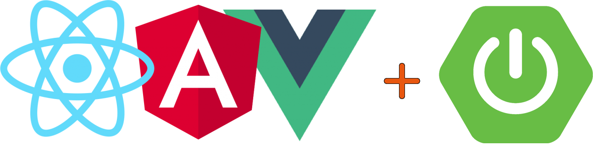

# Frontend framework + Spring



Choose your frontend framework by selecting the correct branch:
* Redux+React
* Angular
* Vue.js+Vuex

## Goal

The goal is to create project seed with:

* Frontend:
    * React / VueJS / Angular
    * Typescript
    * Tests E2E + Jest
    * Bootstrap 4 + customisation
    * Font Awesome 5
    * Websockets


* Backend:
    * Spring Boot (Maven, REST)
    * Unit tests
    * OAuth2
    * Websockets
    * Swagger
    
    
* Moreover:
    * Simplify build and development process for frontend and backend
    * Set up the proxy server that everything works on 8080 port during the development process

## Documentation

### How to run it
* Backend
    * Run project in maven
* Frontend
    * Go to .\src\main\frontend and run `npm install` and after that `npm run serve`

If port 8080 is available then the default frontend page will be on:
```
http://localhost:8080/
```
and backend:
```
http://localhost:8080/api/
```
Backend example:
```
http://localhost:8080/api/hello
```

Frontend files are located in `src\main\frontend`

### Swagger UI
http://localhost:8080/swagger-ui.html

## License

MIT
